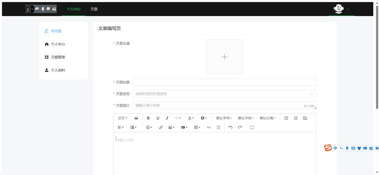
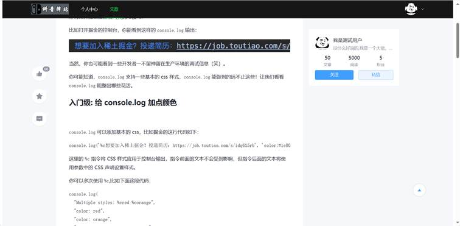
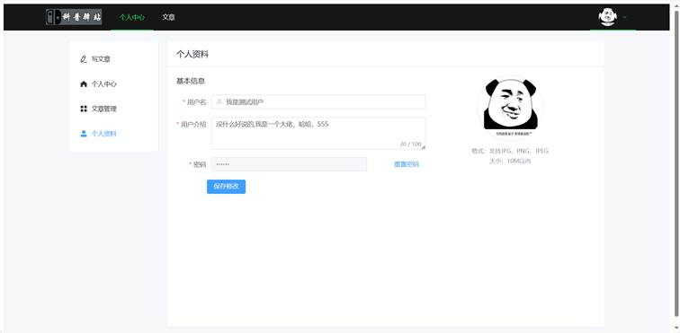
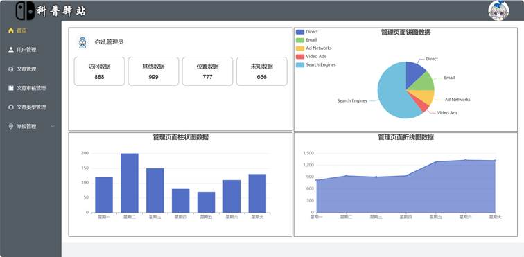
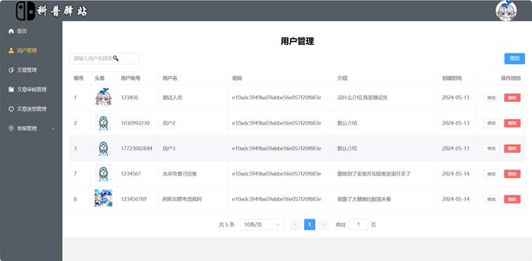
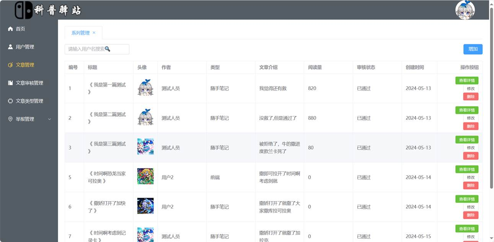
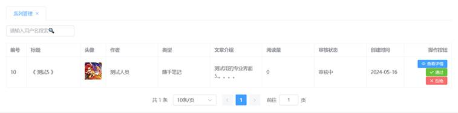
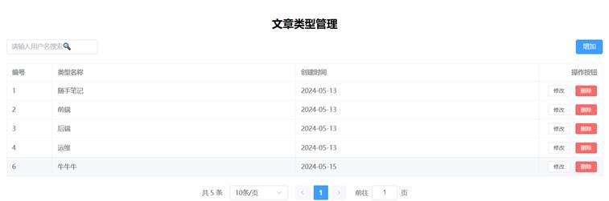
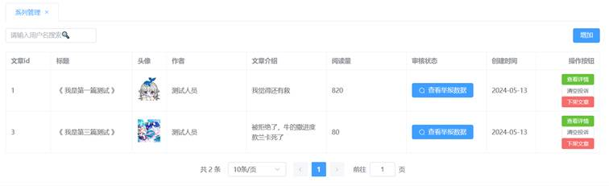
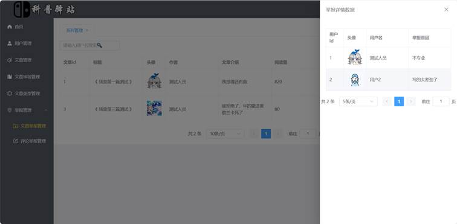

# 毕设项目

* 使用方式
  ~~~bash
  npm install
  cd BlogPool
  npm run dev
  ~~~

## 项目功能

> 1. 登录注册
> 2. 用户功能
>    * 首页
>    * 个人中心（文章管理，点赞中心，收藏中心，关注，粉丝）
>    * 文章管理（发布文章，修改文章，删除文章）
>    * 资料修改
>    * 管理员页面
> 3. 管理员功能
>    * 首页
>    * 用户管理
>    * 文章管理
>    * 文章审核管理
>    * 文章类型管理
>    * 举报管理
>      * 评论举报
>      * 文章举报
>
> ***

### 登录注册

* 登录
  
* 注册
  

### 用户功能

#### 首页

#### 个人中心

1. 个人简介
   

   ***

2. 文章列表
   

   ***

3. 点赞列表
   

   ***

4. 收藏列表
   

   ***

5. 关注列表
   

   ***

6. 粉丝列表
   

   ***

#### 文章管理

1. 发布文章
   
2. 修改文章
   
3. 文章详情
   

#### 资料修改

### 管理员功能

#### 首页

#### 用户管理

#### 文章管理

#### 文章审核

#### 文章类型

#### 举报管理

